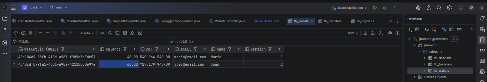
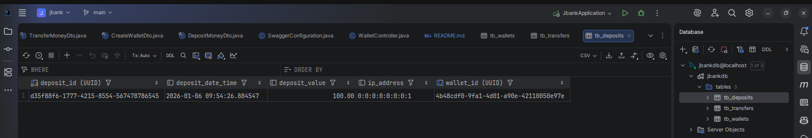
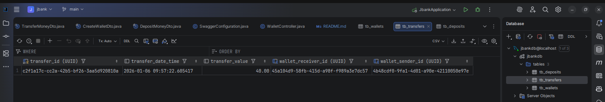
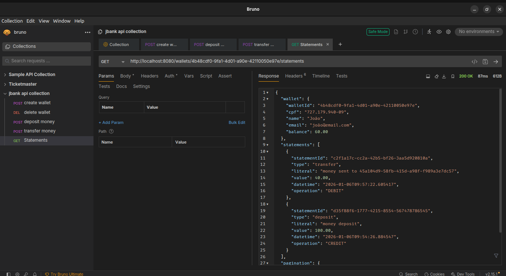

<h1 align="center">
  Projeto JBank com Spring Boot
</h1>

<p align="center">
 <a href="https://www.linkedin.com/in/erly-choqque-layme-449391208" target="_blank">
  
 </a>
 
</p>

## Descrição
O JBank é uma API REST desenvolvida com Spring Boot para a gestão de carteiras bancárias digitais. 
Este projeto foi criado como parte da minha jornada de aprendizado contínuo, focando na implementação de soluções para desafios reais de sistemas financeiros, como concorrência, auditoria e integridade de dados.
## Tecnologias
- Spring Boot 3
- Java 21
- Spring Data JPA
- Hibernate Validator
- Optimistic Locking (@Version)
- MySQL
- Maven
- Auditoria com Filters & Interceptors
- JPA Projections:
- Swagger / OpenAPI

## Funcionalidades
- Gestão de Carteiras: Criação e encerramento de contas (com validação de saldo zerado).
- Depósitos Inteligentes: Realização de depósitos com rastreamento automático do IP do usuário.
- Transferências ACID: Movimentação de fundos entre contas garantindo a consistência dos dados.
- Extratos Detalhados: Histórico completo de transações utilizando projeções para máxima performance.

## 🚀 Execução do projeto
### Pré-requisitos
- Java 21
- Maven
- Docker e Docker Compose
- MySQL 8.0
- IDE (IntelliJ IDEA, VS Code ou similar)

### Clone o repositório
```bash
git clone https://github.com/Erly123/jbank-learning.git
```
### Banco de Dados (MySQL com Docker)
O projeto utiliza MySQL como banco de dados, executado via Docker.  
A criação do banco e do usuário é feita manualmente dentro do container.

1. Suba o container do MySQL:
```bash
docker-compose up -d
```
2. Verifique se o container está em execução:
```bash
docker ps
```
3. Após a verificação, o container pode ser finalizado:
```bash
docker-compose down
```
### ▶️ Executando o projeto
```bash
mvn spring-boot:run
```
A API poderá ser acessada em [localhost:8080](http://localhost:8080).
O Swagger em [localhost:8080/swagger-ui.html](http://localhost:8080/swagger-ui.html)
## API Endpoints

Para fazer as requisições HTTP abaixo, foi utilizada a ferramenta [bruno](https://www.usebruno.com/):

- POST /wallets
```
http://localhost:8080/wallets
{
  "cpf": "727.179.940-09",
  "email": "joão@email.com",
  "name": "João"
}

Status 201 Ok
x-user-ip: 0:0:0:0:0:0:0:1
location: /wallets/4b48cdf0-9fa1-4d01-a90e-42110050e97e
content-length: 0
date: Tue, 06 Jan 2026 12:52:54 GMT
keep-alive: timeout=60
connection:	keep-alive
```
- POST /wallets/{id}/deposits 
```
http://localhost:8080/wallets/4b48cdf0-9fa1-4d01-a90e-42110050e97e/deposits
{
  "value": 100
}

Status 200 Ok
x-user-ip: 0:0:0:0:0:0:0:1
content-length:	0
date: Tue, 06 Jan 2026 12:54:26 GMT
keep-alive: timeout=60
connection: keep-alive
```
- POST /transfers
```
http://localhost:8080/transfers
{
  "sender": "4b48cdf0-9fa1-4d01-a90e-42110050e97e",
  "receiver": "45a104d9-58fb-415d-a98f-f989a3e7dc57",
  "value": 40
}

Status 200 Ok
x-user-ip: 0:0:0:0:0:0:0:1
content-length: 0
date: Tue, 06 Jan 2026 12:57:22 GMT
keep-alive: timeout=60
connection: keep-alive
```
- GET /wallets/{id}/statements
```
http://localhost:8080/wallets/4b48cdf0-9fa1-4d01-a90e-42110050e97e/statements

Status 200 Ok
x-user-ip: 0:0:0:0:0:0:0:1
content-type: application/json
transfer-encoding: chunked
date: Tue, 06 Jan 2026 12:58:25 GMT
keep-alive: timeout=60
connection: keep-alive

{
  "wallet": {
    "walletId": "4b48cdf0-9fa1-4d01-a90e-42110050e97e",
    "cpf": "727.179.940-09",
    "name": "João",
    "email": "joão@email.com",
    "balance": 60.00
  },
  "statements": [
    {
      "statementId": "c2f1a17c-cc2a-42b5-bf26-3aa5d920810a",
      "type": "transfer",
      "literal": "money sent to 45a104d9-58fb-415d-a98f-f989a3e7dc57",
      "value": 40.00,
      "datetime": "2026-01-06T09:57:22.605417",
      "operation": "DEBIT"
    },
    {
      "statementId": "d35f88f6-1777-4215-8554-567478786545",
      "type": "deposit",
      "literal": "money deposit",
      "value": 100.00,
      "datetime": "2026-01-06T09:54:26.884547",
      "operation": "CREDIT"
    }
  ],
  "pagination": {
    "page": 0,
    "pageSize": 10,
    "totalElements": 2,
    "totalPages": 1
  }
}
```
## 📸 Demonstração da DB e bruno
<p align="center">
  
</p>
<p align="center">
  
</p>
<p align="center">
  
</p>
<p align="center">
  
</p>

